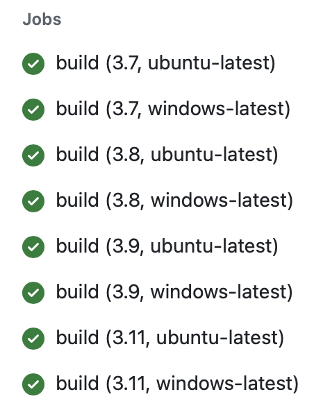

# Kaisen Yao Mini 4: GitHub Actions Matrix Build for Multiple Python Versions

## Project Objective

This project aims to test multiple Python versions and environments using GitHub Actions. The `setup-python` action is utilized alongside the `matrix strategy` to run multiple jobs across different configurations, ensuring compatibility and robustness.

The repository includes a Python script `main.py` with a function `double_number(x)` that takes a number as input and double it for the output. This functionality is validated through unit tests in `test_main.py`.

## Repository Contents

* `main.py`: Contains the `double_number(x)` function.

* `test_main.py`: Contains test cases for `main.py`.

* `.devcontainer`: Configuration for development container.

* `ci.yml`: GitHub Actions workflow for continuous integration (CI).

* `Makefile`: Automation for code formatting, linting, and testing.

* `requirements.txt`: Dependencies for the project.

* `README.md`: Documentation (this file).

## Result

Navigate to the *Actions* page or click on the *CI badge* to view results.

